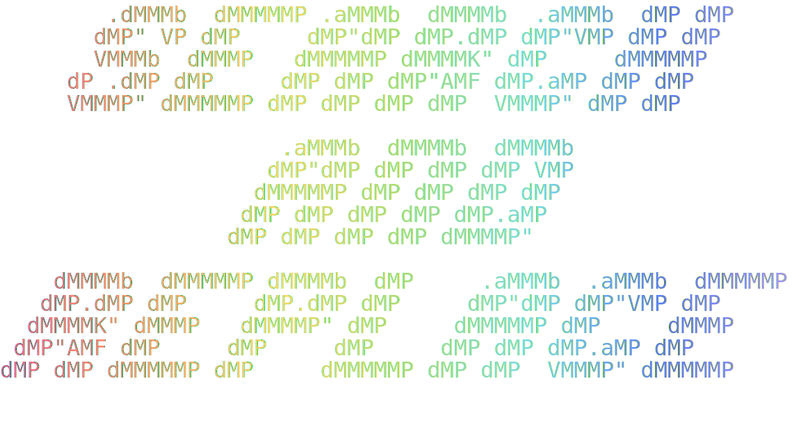
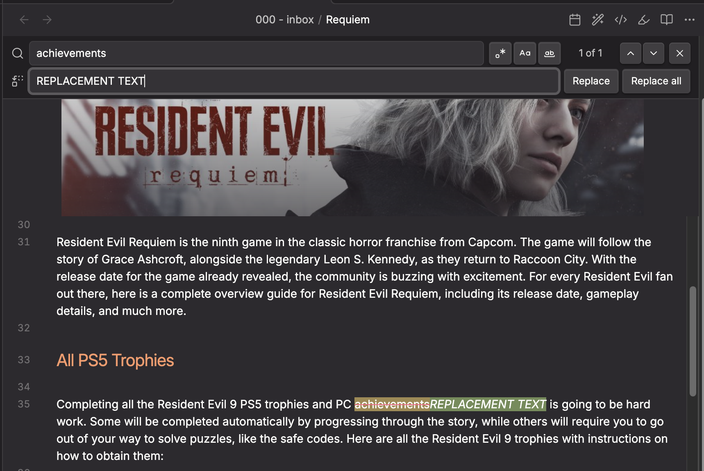
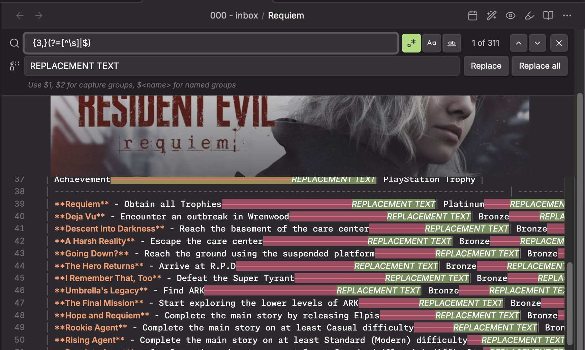

# Better Search and Replace

        

  

An enhanced search and replace plugin for [Obsidian](https://obsidian.md). Provides a floating search bar docked to the top of the editor with live highlighting, real-time diff preview, regex support with capture groups, and more.

Works on both desktop and mobile.

  

## Features

  

- **Floating search bar** -- slides in at the top of the editor (not a modal, not a sidebar)
- **Real-time match highlighting** -- matches are highlighted as you type
- **Live diff preview** -- matched text is shown with strikethrough (red) and the replacement is shown as green ghost text inline, so you can see exactly what will change before committing
- **Regular expression support** -- full JavaScript regex with capture groups (`$1`, `$2`, `$<name>`)
- **Case sensitive toggle** -- match exact case or ignore case
- **Whole word toggle** -- restrict matches to whole words only
- **Match counter** -- shows "3 of 12" style count inline with the search field
- **Match navigation** -- step through matches one at a time with up/down arrows
- **Replace current** -- replace just the current match
- **Replace all** -- replace every match at once
- **Regex validation** -- invalid regex patterns are caught immediately with inline error messages
- **Capture group hint** -- when regex mode is on, a hint reminds you that `$1`, `$2`, `$<name>` are available
- **Customizable colors** -- match highlight, current match, strikethrough, and preview colors are all configurable in settings
- **Keyboard shortcuts** -- Enter/Shift+Enter to navigate, Escape to close, Enter in replace field to replace current, Shift+Enter to replace all
- **Command palette integration** -- open via "Better Search and Replace: Open"
- **Note toolbar integration** -- accessible from the helpers modal when the note-toolbar plugin is installed

## How to Use

1. Open the command palette and run **Better Search and Replace: Open**
2. Type your search query in the search field
3. Matches are highlighted in the editor in real time
4. Use the toggle buttons to enable:
    - `.*` Regex mode
    - `Aa` Case sensitivity
    - `W` Whole word matching
5. Type replacement text in the replace field to see a live diff preview
6. Click **Replace** to replace the current match, or **Replace All** to replace every match
7. Press **Escape** or click the X button to close the search bar

### Regex Capture Groups

When regex mode is enabled, you can use standard JavaScript replacement patterns in the replace field:

| Pattern         | Meaning                              |
| --------------- | ------------------------------------ |
| `$1`, `$2`, ... | Capture group 1, 2, etc.             |
| `$<name>`       | Named capture group (`(?<name>...)`) |
| `$&`            | The entire matched substring         |
| `` $` ``        | Text before the match                |
| `$'`            | Text after the match                 |
| `$$`            | A literal `$`                        |

## Installation

### Manual

1. Copy `main.js`, `manifest.json`, and `styles.css` into your vault's `.obsidian/plugins/obsidian-better-search-and-replace/` directory
2. Enable the plugin in Obsidian's Community Plugins settings

### From Release

1. Download the latest release from the [Releases](https://github.com/saltyfireball/obsidian-better-search-and-replace/releases) page
2. Extract `main.js`, `manifest.json`, and `styles.css` into `.obsidian/plugins/obsidian-better-search-and-replace/`
3. Enable the plugin in Obsidian settings

## Settings

- **Default search options** -- set whether regex, case sensitivity, and whole word matching are on by default
- **Match highlight color** -- background color for matched text
- **Match strikethrough color** -- color of the strikethrough line on matches when replacement is shown
- **Replacement preview color** -- background color for the ghost replacement text
- **Current match highlight color** -- background color for the currently selected match

Default colors use the Monokai Pro palette:

- Match: Red (#FF6188) at 25% opacity
- Current match: Yellow (#FFD866) at 35% opacity
- Preview: Green (#A9DC76) at 25% opacity

## License

[MIT](LICENSE)
